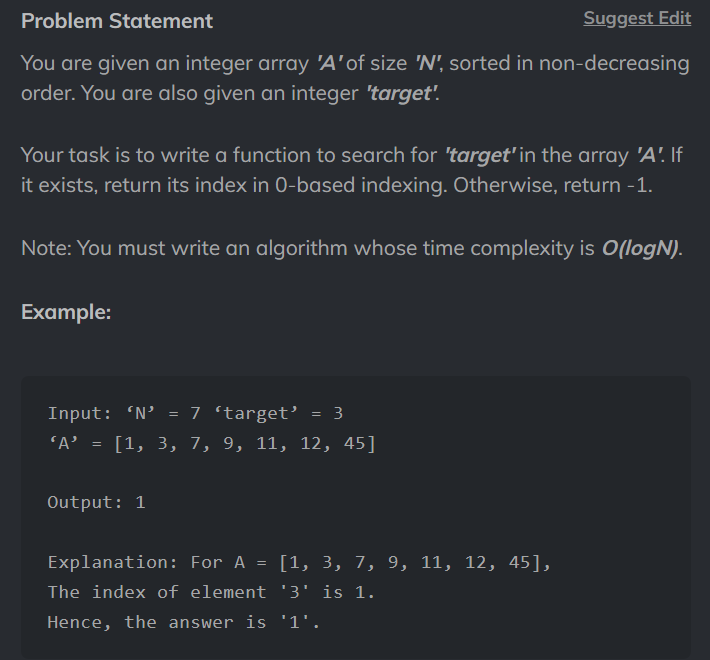

# Binary Search



[CodeStudio - Easy](https://www.codingninjas.com/studio/problems/binary-search_972?utm_source=striver&utm_medium=website&utm_campaign=a_zcoursetuf)

[LeetCode - Easy](https://leetcode.com/problems/binary-search)

## Code

```
class Solution {
    public static int bs(int[] nums,int left, int right, int target){
        if(left<=right){
            int mid = left + (right - left )/2;
            if(nums[mid] == target) return mid;

            if(target > nums[mid]) return bs(nums,mid+1,right,target);

            if(target < nums[mid]) return bs(nums,left, mid-1,target);
        }
            return -1;
    }
    public int search(int[] nums, int target) {
        return bs(nums,0,nums.length-1,target);
    }
}```
