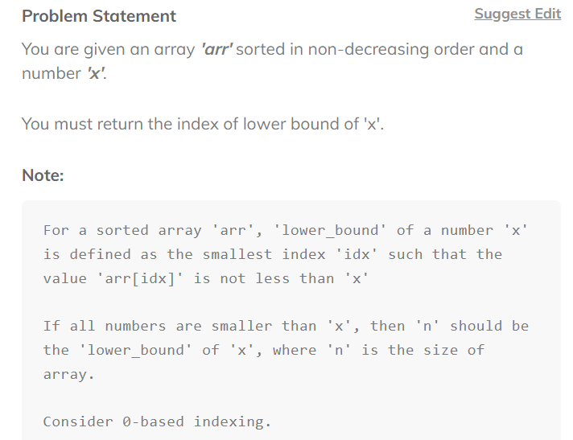
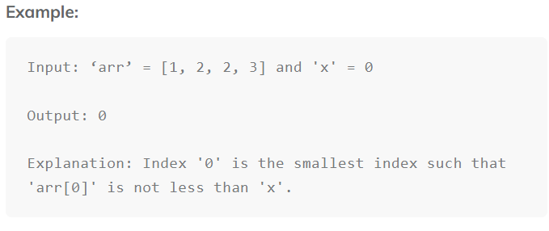

# Lower Bound using Binary Search

  

  

## Code

```
public class Solution {
    
    public static int solve(int[] arr,int x,int left,int right,int ans){
        if(left>right){
            return ans;
        }else{
            int mid = left + (right - left)/2;
        if(arr[mid]>=x){
            ans = mid;
            return solve(arr, x, left, mid - 1, ans);
        }
        if(arr[mid] < x){
            return solve(arr, x, mid + 1, right, ans);
        }
        }
    return ans;
        
    }
    public static int lowerBound(int []arr, int n, int x) {
        return solve(arr, x, 0, n-1,n);
    }
}
```