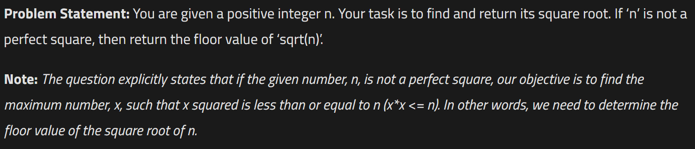

# Finding Sqrt of a number using Binary Search

  

## Code

### Approach 1 - Linear Search

##### Naive Approach(Using linear search):   
We can guarantee that our answer will lie between the range from 1 to n i.e. the given number. So, we will perform a linear search on this range and we will find the maximum number x, such that x*x <= n.  

##### Algorithm:   
We will first declare a variable called ‘ans’.
Then, we will first run a loop(say i) from 1 to n.
Until the value i*i <= n, we will update the variable ‘ans’, with i.
Once, the value i*i becomes greater than n, we will break out from the loop as the current number i, or the numbers greater than i, cannot be our answers. 
Finally, our answer should have been stored in ‘ans’.  

```
public static int floorSqrt(int n) {
        int ans = 0;
        // linear search on the answer space
        for (long i = 1; i <= n; i++) {
            long val = i * i;
            if (val <= (long) n) {
                ans = (int) i;
            } else {
                break;
            }
        }
        return ans;
    }
```

### Approach 2 - Built in funtion

Straight forward solution
  
  ```
  public static int floorSqrt(int n) {
        int ans = (int) Math.sqrt(n);
        return ans;
    }
```

### Approach 3 - Binary Search ( optimal solution )  

```
import java.util.* ;
import java.io.*; 

public class Solution {

	public static int bs(int[] a, int left, int right, int n,int ans){
		if(left<= right){
			int mid = left + (right - left)/2;
			if((long)mid * mid <= n){
				ans =mid;
				return bs(a, mid + 1, right, n, ans);
			}else{
				
				return bs(a, left, mid -1, n, ans);
			}
		}
		return ans;
	}
	public static int sqrtN(long N) {
		int ans = 0;
		if(N==0) return 0;
		int[] a = new int[(int)N];
		return bs(a, 1, (int) N, (int) N, ans); 
		
	}
}

```

<b> Important </b>  

- If __(mid*mid <= n)__: On satisfying this condition, we can conclude that the number ‘mid’ is one of the possible answers. So, we will store ‘mid’ in the variable ‘ans’. But we want the maximum number that holds this condition. So, we will eliminate the left half and consider the right half(i.e. low = mid+1).  
- __Otherwise__, the value mid is larger than the number we want. This means the numbers greater than ‘mid’ will not be our answers and the right half of ‘mid’ consists of such numbers. So, we will eliminate the right half and consider the left half(i.e. high = mid-1).