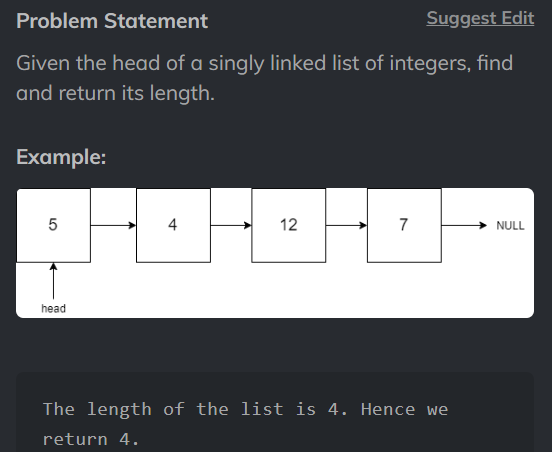

# Count nodes of linked list



[CodeStudio](https://www.codingninjas.com/studio/problems/count-nodes-of-linked-list_5884?utm_source=striver&utm_medium=website&utm_campaign=a_zcoursetuf)   

## Code

```
/****************************************************************

 Following is the class structure of the Node class:

 class Node {
     public int data;
     public Node next;
    
     Node()
     {
         this.data = 0;
         this.next = null;
     }
    
     Node(int data)
     {
         this.data = data;
         this.next = null;
     }
    
     Node(int data, Node next)
     {
         this.data = data;
         this.next = next;
     }
 }

 *****************************************************************/

public class Solution {
    public static int length(Node head){
        if(head.next==null){
            return 0;
        }
        int count = 1;
        Node list = head;
        while(list.next!=null){
            count++;
            list =  list.next;
        }
        return count;
    }
}
```