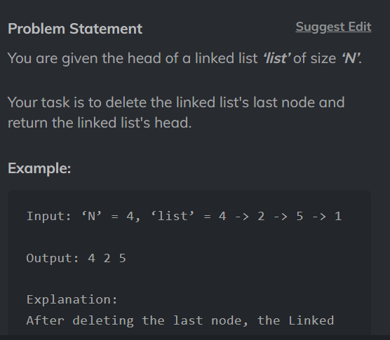

# Delete Node Of Linked List



[CodeStudio](https://www.codingninjas.com/studio/problems/delete-node-of-linked-list_8160463?utm_source=striver&utm_medium=website&utm_campaign=a_zcoursetuf)

## Code

```
/****************************************************************

 Following is the class structure of the Node class:

 class Node {
     public int data;
     public Node next;

     Node()
     {
         this.data = 0;
         this.next = null;
     }

     Node(int data)
     {
         this.data = data;
         this.next = null;
     }

     Node(int data, Node next)
     {
         this.data = data;
         this.next = next;
     }
 };

 *****************************************************************/

public class Solution {
    public static Node deleteLast(Node list){
        if (list == null || list.next == null) {
            return null; // No nodes or only one node, so no nodes left after deletion
        }
        Node nextHead = list;
        Node previous = null;
        while(head.next!=null){
            previous = nextHead;
            nextHead = nextHead.next;
        }
        nextHead.next = null;
        return list;
    }
}
```