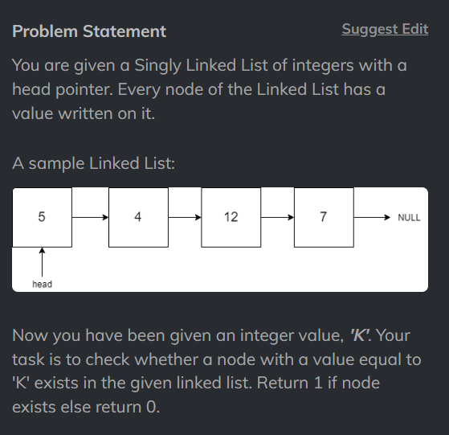

# Search an element in the LL


[CodeStudio-Easy](https://www.codingninjas.com/studio/problems/search-in-a-linked-list_975381?utm_source=striver&utm_medium=website&utm_campaign=a_zcoursetuf)

## Code
```
/****************************************************************

 Following is the class structure of the Node class:

 class Node {
     public int data;
     public Node next;
    
     Node()
     {
         this.data = 0;
         this.next = null;
     }
    
     Node(int data)
     {
         this.data = data;
         this.next = null;
     }
    
     Node(int data, Node next)
     {
         this.data = data;
         this.next = next;
     }
 }

 *****************************************************************/


public class Solution
{
    public static int searchInLinkedList(Node head, int k)
    {
        if(head == null ) return 0;
        Node newNode = head;
        while(newNode!= null){
            if(newNode.data == k){
                return 1;
            }
            newNode = newNode.next;
        }
        return 0;
    }
}
```

