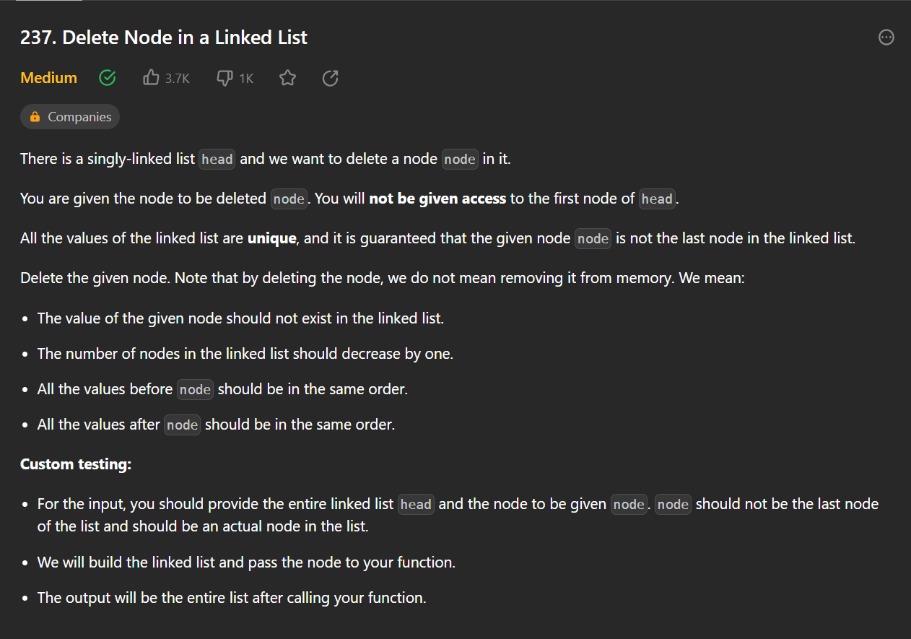
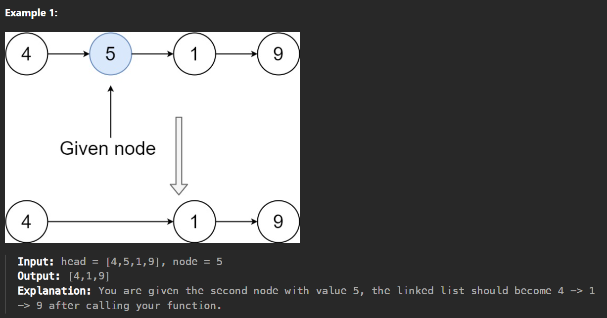

# deleteNode

[Leetcode - Medium](https://leetcode.com/problems/delete-node-in-a-linked-list)





## Code

```
/**
 * Definition for singly-linked list.
 * public class ListNode {
 *     int val;
 *     ListNode next;
 *     ListNode(int x) { val = x; }
 * }
 */
class Solution {
     public void deleteNode(ListNode node) {
        ListNode nextNode = node.next;
        node.val = nextNode.val;
        node.next = nextNode.next;

        
    }
}
```