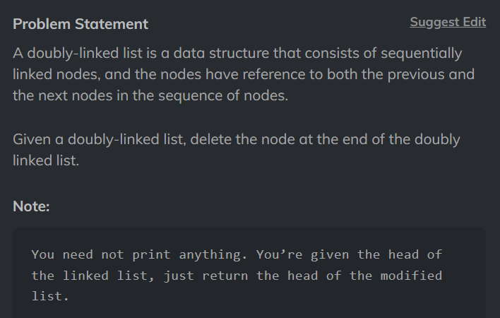

# Delete Last Node of a Doubly Linked List

Problem Statement: Given a Doubly Linked List. Delete last of a Doubly Linked List.



## Code

```
/****************************************************************

 Following is the class structure of the Node class:

 class Node {
     public int data;
     public Node next;
     public Node prev;

     Node()
     {
         this.data = 0;
         this.next = null;
         this.prev = null;
     }

     Node(int data)
     {
         this.data = data;
         this.next = null;
         this.prev = null;
     }

     Node(int data, Node next, Node prev)
     {
         this.data = data;
         this.next = next;
         this.prev = prev;
     }
 };

 *****************************************************************/

public class Solution
{
    public static Node deleteLastNode(Node head) {

        if(head == null || head.next == null){
            return null;
        }
        Node previous = null;
        Node current = head;
        while(current.next != null){
            previous = current;
            current = current.next;
        }

        previous.next = null;
        return head;
    }
}
```