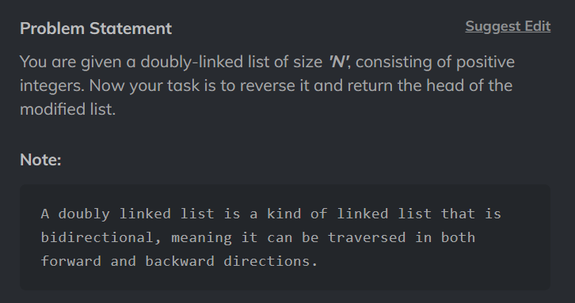

# Reverse A Doubly Linked List

  


[CodeStudio - Easy](https://www.codingninjas.com/studio/problems/reverse-a-doubly-linked-list_1116098?utm_source=striver&utm_medium=website&utm_campaign=a_zcoursetuf)  


## Code

```
/****************************************************************

 Following is the class structure of the Node class:

 class Node {
     public int data;
     public Node next;
     public Node prev;

     Node()
     {
         this.data = 0;
         this.next = null;
         this.prev = null;
     }

     Node(int data)
     {
         this.data = data;
         this.next = null;
         this.prev = null;
     }

     Node(int data, Node next)
     {
         this.data = data;
         this.next = next;
         this.prev = next;
     }
 };

 *****************************************************************/

public class Solution
{
    public static Node reverseDLL(Node head){
        Node temp = null;
        Node current = head;

        while (current != null) {
            temp = current.prev;
            current.prev = current.next;
            current.next = temp;
            current = current.prev;
        }

        if (temp != null) {
            head = temp.prev;
        }
        return head;
    }
}
```

## With explaination
```
public void reverse() {
    Node temp = null;     // Temporary pointer to store the original prev node
    Node current = head;  // Pointer to traverse the linked list
    
    while (current != null) {
        // Store the current node's prev pointer in the temp pointer
        temp = current.prev;
        
        // Update the current node's prev and next pointers
        current.prev = current.next;
        current.next = temp;
        
        // Move the current pointer to the previous node
        current = current.prev;
    }

    // Update the head pointer to the last node (now the first in the reversed list)
    if (temp != null) {
        head = temp.prev;
    }
}
```