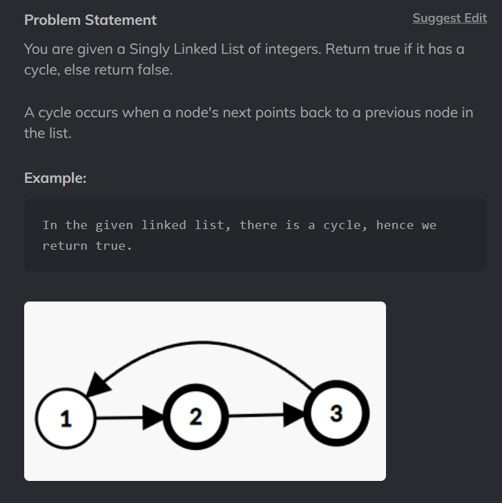

# Cycle Detection in a Singly Linked List



[CodeStudio - Medium](https://www.codingninjas.com/studio/problems/cycle-detection-in-a-singly-linked-list_628974?utm_source=striver&utm_medium=website&utm_campaign=a_zcoursetuf)

[Leetcode - Easy](https://leetcode.com/problems/linked-list-cycle)

```
/**
 * Definition for singly-linked list.
 * class ListNode {
 *     int val;
 *     ListNode next;
 *     ListNode(int x) {
 *         val = x;
 *         next = null;
 *     }
 * }
 */
public class Solution {
    public boolean hasCycle(ListNode head) {
        if (head == null || head.next == null) {
            return false;
        }
        ListNode slow = head;
        ListNode fast = head.next;
        
        while (fast != null && fast.next != null) {
            if (slow == fast) {
                return true;
            }
            slow = slow.next;
            fast = fast.next.next;
        }
        
        return false;
    }
}
```