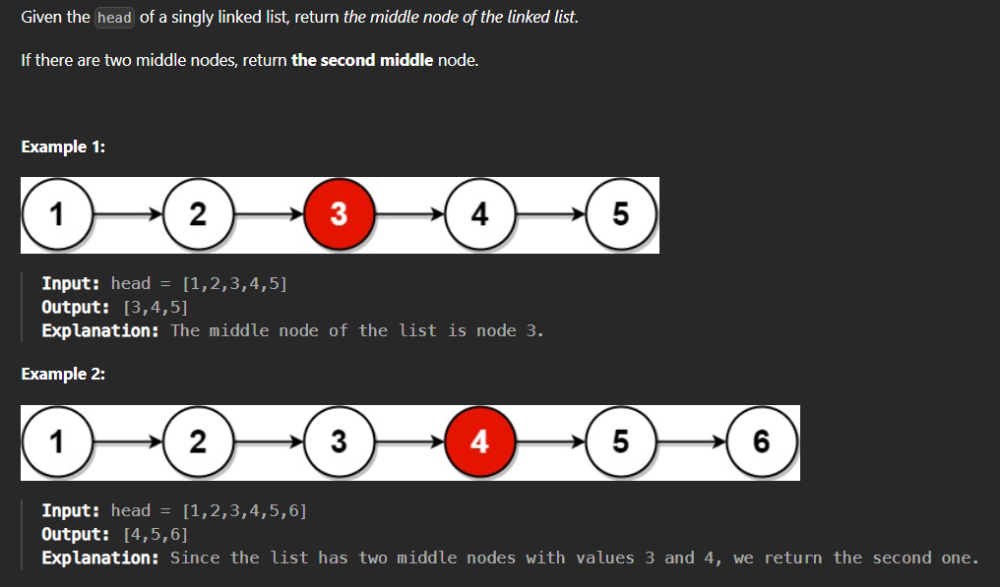

# Find middle element in a Linked List

## Problem Statement  
Given the head of a singly linked list, return the middle node of the linked list. If there are two middle nodes, return the second middle node.



[Leetcode - Easy](https://leetcode.com/problems/middle-of-the-linked-list/description/)

[CodeStudio - Easy](https://www.codingninjas.com/studio/problems/middle-of-linked-list_973250?utm_source=striver&utm_medium=website&utm_campaign=a_zcoursetuf) 


## Code

```
/**
 * Definition for singly-linked list.
 * public class ListNode {
 *     int val;
 *     ListNode next;
 *     ListNode() {}
 *     ListNode(int val) { this.val = val; }
 *     ListNode(int val, ListNode next) { this.val = val; this.next = next; }
 * }
 */
class Solution {
    public ListNode middleNode(ListNode head) {
        ListNode tail = head;
        int count = 0;
        while(tail.next !=null){
            tail = tail.next;
            count++;
        }
        if(count %2==0){ count = count/2;
        }else{ count = count/2+1;}
        System.out.println(count);
        
        tail = head;

        while(count!=0){
            tail = tail.next;
            count--;
        }

        return tail;
    }
}```
