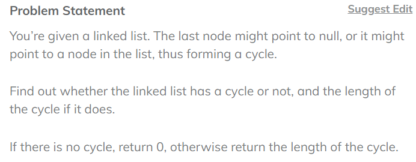

# 	Length of Loop in LL

## Code

public class Solution{
    
    public static int lengthOfLoop(Node head) {
    Node fast = head;
    Node slow = head;
    Node entry = head;
    Boolean loopfound = false;
        
    while(fast.next != null&&fast.next.next != null) {
        slow = slow.next;
        fast = fast.next.next;
            
        if(slow == fast) {
            loopfound= true;
            break;
        }
    }

    if(!loopfound) return 0;

     int length = 1;
        fast = fast.next;
        while (fast != slow) {
            fast = fast.next;
            length++;
        }

        return length;
    }
}