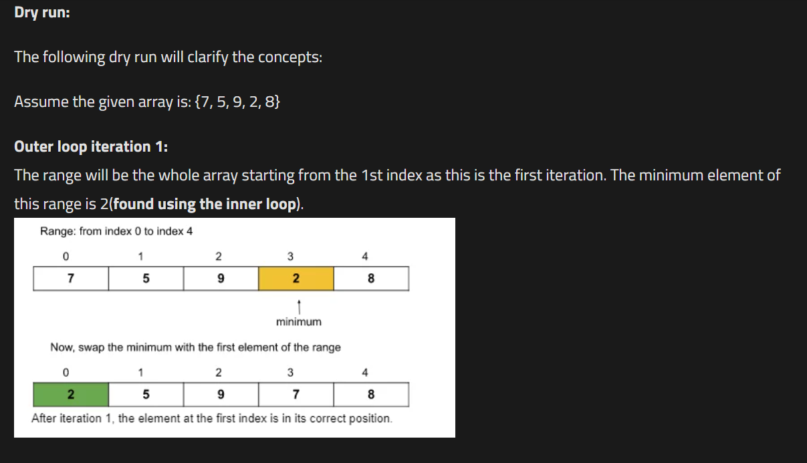

# Bubble Sort




we will traverse from left to right and start comparing adjacent element and if 'j' index value is greater than 'j+1' we will swap the value

## Code

```

public class Solution {
    public static void bubbleSort(int[] arr, int n) {
        int i,j,temp;
        boolean swapped;
        for(i =0;i<n-1;i++){
            swapped = false;
            for(j = 0;j<n-i-1;j++){
                //swap
                if(arr[j]>arr[j+1]){
                    temp = arr[j];
                    arr[j] = arr[j+1];
                    arr[j+1] = temp;
                    swapped = true;
                }
            }

            if(!swapped)break;
        }
    }

}
```

    Time Complexity : O(n^2)   
    Space Complexity : O(1)