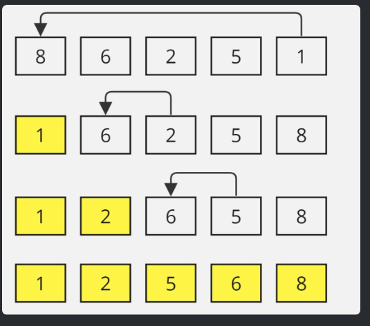

# Selection Sort

Given an unsorted array of size N, use selection sort to sort arr[] in increasing order.




This sorting technique is very simple and efficient that works by repeatedly selecting the smallest ( or largest) element from the unsorted array and place in sorted range of array ( in case of selecting min value it will be in first)  

## Code

```
public class Solution {
    public static void selectionSort(int[] arr) {
        int n = arr.length;
        for(int i =0;i<n-1;i++){
            int min_index = i;
            for(int j = i+1;j<n;j++){
                if(arr[j]<arr[min_index]){
                    min_index = j;
                }
            }
            int temp = arr[min_index];
            arr[min_index] = arr[i];
            arr[i] = temp;
        }
    }
}
```

    Time Complexity : O(n^2)   
    Space Complexity : O(1)